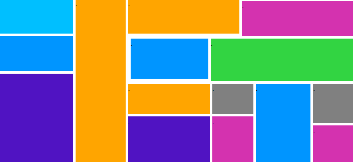

<h1 align="center"> DISPLAY-FLEXBOX </h1>

Exercício feito em sala de aula para a matéria da eletiva WEB   

 

  

## 🚀 Tecnologias

Esse projeto foi desenvolvido com as seguintes tecnologias:

- HTML e CSS

## 💻 Aprendizado

Formas que o CSS interage com o código HTMl e responsividade da página.

---

Feito com ♥ por Murilo Baron Pereira :wave: